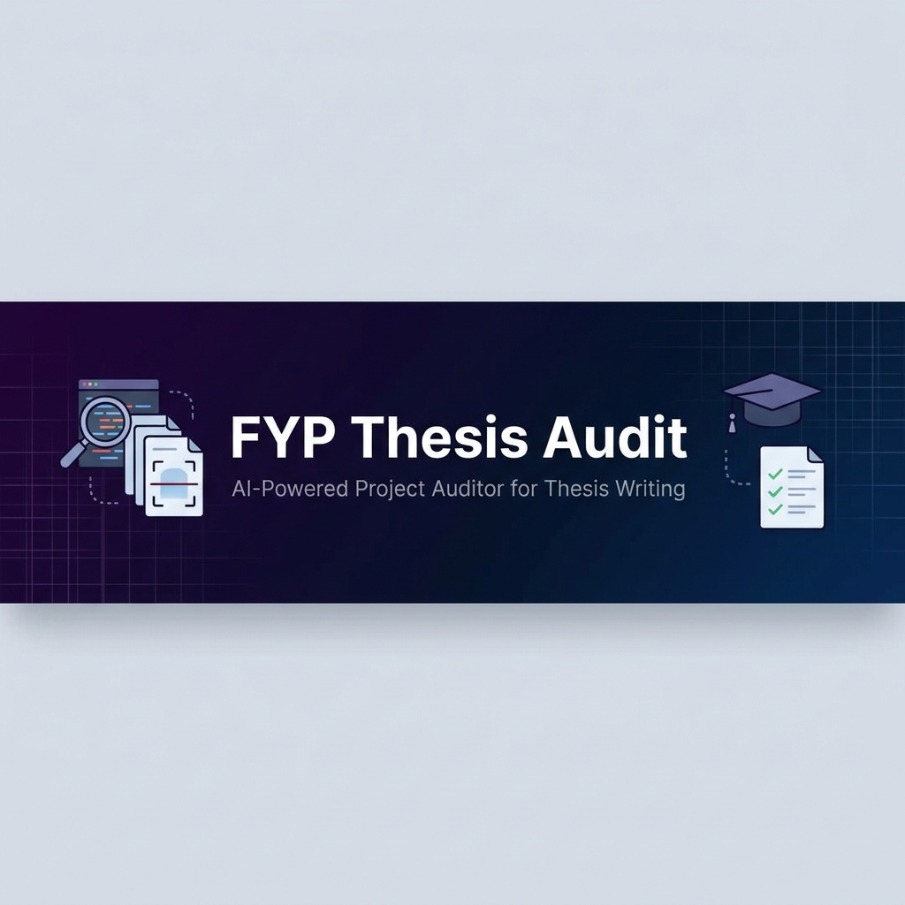

<p align="center">
  
</p>

<h1 align="center">📝 FYP Thesis Audit</h1>

<p align="center">
  <strong>AI-Powered Project Auditor for FYP Thesis Writing</strong><br/>
  Audit any software project → Generate thesis-ready documentation → Write your thesis with AI
</p>

<p align="center">
  <a href="#-quick-start"></a>
  <a href="#-supported-projects"></a>
  <a href="#-supported-projects"></a>
  <a href="#-supported-projects"></a>
  <a href="#-supported-projects"></a>
</p>

<p align="center">
  
  
  
  
</p>

---

## 🤔 What Is This?

Writing a **Final Year Project (FYP) thesis** is hard. You spend weeks analyzing your own project, documenting features, drawing diagrams, and formatting chapters — all manually.

**FYP Thesis Audit** automates the hardest part: **understanding and documenting your project.** 

It gives any AI assistant (ChatGPT, Gemini, Claude, Copilot) a structured set of instructions to:

1. 🔍 **Audit** your entire codebase (architecture, features, database, APIs, UI)
2. 📄 **Generate** a comprehensive `PROJECT_AUDIT.md` with ALL project details
3. 📝 **Write** your thesis chapter-by-chapter using the audit data

> **Built for University of Malakand CS Department** thesis format — but works for any university with minor adjustments.

---

## ✨ What You Get

| Output | Description |
|--------|-------------|
| 📊 **Complete Project Audit** | 18-section document covering every aspect of your project |
| 🗃️ **ERD Data** | All entities, attributes, relationships — ready for diagrams |
| 📈 **DFD Data** | Level-0 and Level-1 data flow specifications |
| 👤 **Use Case Data** | All actors, use cases, include/extend relationships |
| 📸 **Screenshot Guide** | Exactly which screens to capture and where they go |
| 🧪 **Test Cases** | Pre-built test case table for Chapter 7 |
| 📖 **Thesis Structure** | Complete 8-chapter format with formatting rules |
| 🤖 **AI Prompts** | Ready-to-use prompts to generate each chapter |

---

## 🚀 Quick Start

### Prerequisites
- Any AI coding assistant: **Gemini Code Assist**, **GitHub Copilot**, **Cursor**, **ChatGPT**, **Claude**, etc.
- Your FYP project source code

### Step 1: Clone This Repo

```bash
git clone https://github.com/rahimdev4/FYP-Thesis-Audit.git
```

### Step 2: Copy to Your Project

```bash
# Copy the audit skill into your FYP project
cp -r FYP-Thesis-Audit/skill/ /path/to/your/project/thesis-audit/
```

**Example:**
```bash
# If your project is a Flutter app
cp -r FYP-Thesis-Audit/skill/ ~/Desktop/MyFYPApp/thesis-audit/

# If your project is a React web app  
cp -r FYP-Thesis-Audit/skill/ ~/Desktop/MyWebApp/thesis-audit/

# If your project is a Python backend
cp -r FYP-Thesis-Audit/skill/ ~/Desktop/MyAPI/thesis-audit/
```

### Step 3: Run the Audit

Open your project in any AI coding assistant and paste this prompt:

```
Read the file `thesis-audit/audit_prompt.md` and follow ALL instructions in it.

Audit this entire project and generate the output file `PROJECT_AUDIT.md` 
in the project root, using the template from `thesis-audit/audit_template.md`.

Fill in every section completely. Do not skip anything. Read actual source 
code files — don't guess from file names.
```

> ⏱️ The AI will take 5-10 minutes to scan your entire codebase and generate the audit.

### Step 4: Generate Your Thesis

Once `PROJECT_AUDIT.md` is ready, use these prompts to write each chapter:

```
Read `PROJECT_AUDIT.md` for complete project details.
Read `thesis-audit/thesis_structure.md` for the thesis format and rules.

Write Chapter 1: INTRODUCTION of my FYP thesis.
Follow University of Malakand CS Department formatting exactly.
Use only the data from the audit file. Do not make up any features.
Target length: 5-6 pages.
```

**Repeat for each chapter (1 through 8)**, changing the chapter number and name.

---

## 📁 Repository Structure

```
FYP-Thesis-Audit/
├── README.md                          # This file
├── LICENSE                            # MIT License
├── skill/                             # ← Copy this folder to your project
│   ├── audit_prompt.md                # AI instructions for auditing
│   ├── audit_template.md             # 18-section output template
│   └── thesis_structure.md           # UoM thesis format + chapter guides
├── examples/                          
│   └── NoteNest_PROJECT_AUDIT.md     # Real example audit (NoteNest app)
└── assets/
    └── banner.png                     # Repo banner image
```

---

## 📋 Thesis Chapters (UoM Format)

| Chapter | Title | Pages | Key Content |
|---------|-------|-------|-------------|
| **1** | Introduction | 5-6 | Background, problem statement, objectives, scope, motivation |
| **2** | System Analysis | 5-6 | Current vs proposed system, feasibility study, requirements |
| **3** | Conceptual Database Design | 5-6 | ER Diagram, entity-attribute descriptions, data dictionary |
| **4** | Physical Database Design | 4-5 | Table structures, data types, constraints, storage strategy |
| **5** | Functional Modelling | 5-6 | DFD Level-0, DFD Level-1, Use Case Diagram |
| **6** | User Interface & Features | 6-8 | Screenshots + description of every screen |
| **7** | System Testing | 3-4 | Test strategy, test cases table, test evidence |
| **8** | Conclusion & Future Work | 2-3 | Summary, challenges, social impact, future enhancements |

### Formatting Rules

| Rule | Specification |
|------|--------------|
| Font | Times New Roman, 12pt body |
| Headings | 14pt Bold, chapter titles ALL-CAPS |
| Spacing | 1.5 line spacing |
| Margins | 1 inch (Left: 1.5 inch for binding) |
| Figures | Numbered by chapter — Figure 3.1, Figure 6.5 |
| Tables | Numbered by chapter — Table 4.1, Table 7.1 |
| Citations | Numeric style — [1], [2], [3] |
| Total Pages | 50-70 pages |

---

## 🔧 Supported Projects

This audit tool works with **any software project** that has readable source code:

| Framework | Language | Type |
|-----------|----------|------|
| **Flutter** | Dart | Mobile Apps (Android/iOS) |
| **React / Next.js** | JavaScript/TypeScript | Web Apps |
| **React Native** | JavaScript | Mobile Apps |
| **Node.js / Express** | JavaScript | Backend APIs |
| **Django / Flask** | Python | Web Apps / APIs |
| **Laravel** | PHP | Web Apps |
| **Spring Boot** | Java/Kotlin | Backend APIs |
| **SwiftUI** | Swift | iOS Apps |
| **Android Native** | Kotlin/Java | Android Apps |
| **ASP.NET** | C# | Web Apps / APIs |

---

## 💡 Pro Tips

### For Better Audit Results
- ✅ Make sure your project **compiles/builds** before auditing
- ✅ Have a **clean project structure** (organized folders, named files)
- ✅ Include a basic **README** in your project
- ✅ Use **descriptive variable/function names** in your code

### For Better Thesis Output
- 📖 Generate **one chapter at a time** — don't ask for all 8 at once
- 📸 Take **screenshots** yourself for Chapter 6 (AI can't take them)
- 📊 Ask the AI to **generate diagrams** (ERD, DFD, Use Case) from the audit data
- ✏️ **Review and edit** — AI writes the draft, you polish it
- 📝 Fill in **placeholders** manually (student name, supervisor, roll numbers)

### For Diagrams
After the audit, ask the AI:
```
Using the ERD data from Section 11 of PROJECT_AUDIT.md, 
generate an Entity Relationship Diagram for my project.
```
```
Using the DFD data from Section 12 of PROJECT_AUDIT.md,
generate a DFD Level-0 (Context Diagram) and DFD Level-1.
```
```
Using the Use Case data from Section 13 of PROJECT_AUDIT.md,
generate a UML Use Case Diagram.
```

You can also use free tools:
- **[draw.io](https://app.diagrams.net)** — Free online diagram tool
- **[Lucidchart](https://lucid.app)** — Free tier available
- **[Mermaid Live Editor](https://mermaid.live)** — Code-based diagrams

---

## 📖 Full Workflow Example

```
Your FYP Project (e.g., MyApp/)
         │
         ▼
    ┌──────────────┐
    │ Copy skill/  │  ← Step 1: Copy audit files to your project
    │ to project   │
    └──────┬───────┘
           │
           ▼
    ┌──────────────┐
    │ AI reads     │  ← Step 2: AI reads audit_prompt.md  
    │ audit_prompt │     and scans your entire codebase
    └──────┬───────┘
           │
           ▼
    ┌──────────────────┐
    │ PROJECT_AUDIT.md │  ← Step 3: AI generates comprehensive 
    │ (300-500 lines)  │     audit document with ALL details
    └──────┬───────────┘
           │
           ▼
    ┌──────────────────┐
    │ AI reads audit + │  ← Step 4: AI reads audit + thesis  
    │ thesis_structure │     structure and writes each chapter
    └──────┬───────────┘
           │
           ▼
    ┌──────────────────┐
    │ Complete Thesis   │  ← Output: 8 chapters, properly formatted
    │ (50-70 pages)    │     for University of Malakand CS Dept
    └──────────────────┘
```

---

## 🤝 Contributing

Found a way to improve the audit? Have a different university format? Contributions are welcome!

1. Fork this repository
2. Create your branch (`git checkout -b feature/your-university`)
3. Add your thesis structure to `skill/` or create a new format
4. Submit a Pull Request

### Ideas for Contributions
- Add thesis formats for other Pakistani universities
- Add thesis formats for international universities  
- Improve the audit template with more sections
- Add example audits for different project types
- Translate to Urdu

---

## 📄 License

This project is licensed under the **MIT License** — see the [LICENSE](LICENSE) file for details.

You are free to use, modify, and share this tool. If it helps you, give it a ⭐!

---

## 👨‍💻 Author

**Rahim Dev** — [@rahimdev4](https://github.com/rahimdev4)

> Built from the experience of writing the NoteNest FYP thesis at University of Malakand, CS Department.

---

<p align="center">
  <strong>If this helps you write your thesis, please ⭐ star this repo!</strong><br/>
  <sub>Made with ❤️ for CS students at University of Malakand and beyond</sub>
</p>
